# Marketplace Web Application

**Marketplace Web Application** is a full-stack web platform, built with **Java and Spring Boot** for the backend, **React and JavaScript** for the frontend, and **PostgreSQL** as the database.

## Functionalities

- **User Authentication:** Registration, email verification, JWT-based login, and password recovery  
- **Ad Management:** Post, view, search (with filters), and manage ads  
- **Favorites:** Save favorite ads for fast access  
- **User Profiles:** View and edit user information  
- **Instant Chat & Notifications:** Communicate with other users and get notified  
- **Ordering & Payments:** Place orders with online payments with Stripe or pay on delivery  
- **Owner Features:** View own ads and manage listings  

---

## Database Diagram

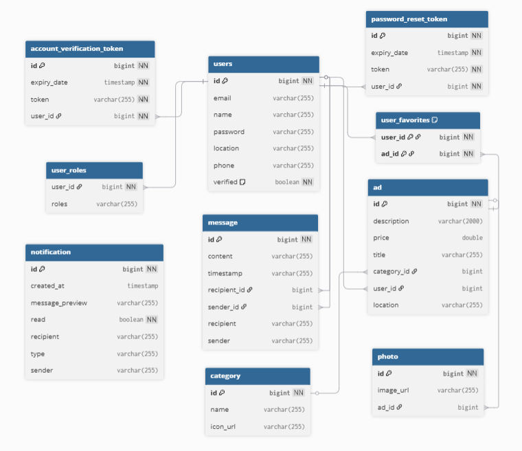
    

## Application Screenshots

### Homepage
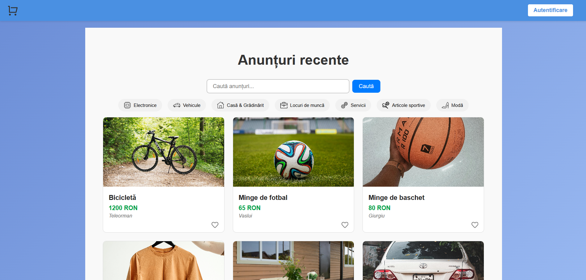
  

### Search results page
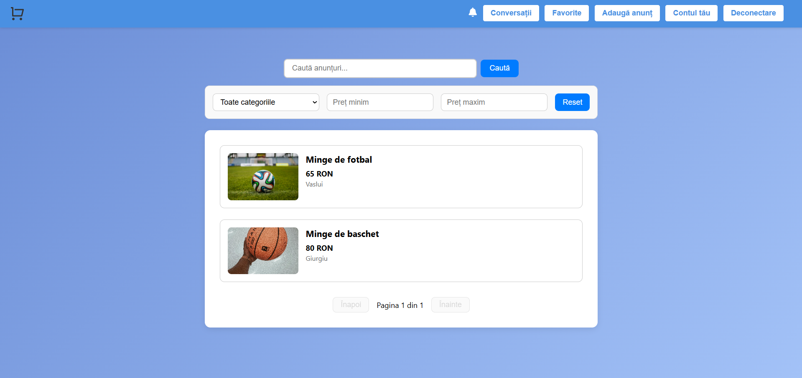
  

### Ad viewing page

  

### Chat window
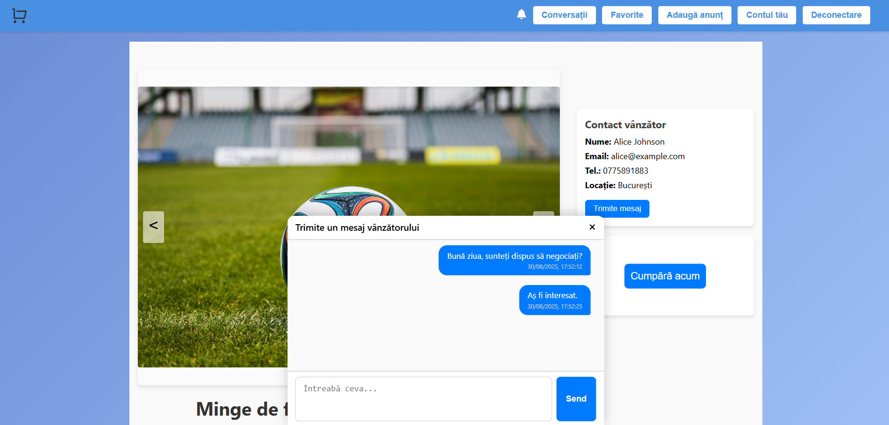
  

### Account registration form
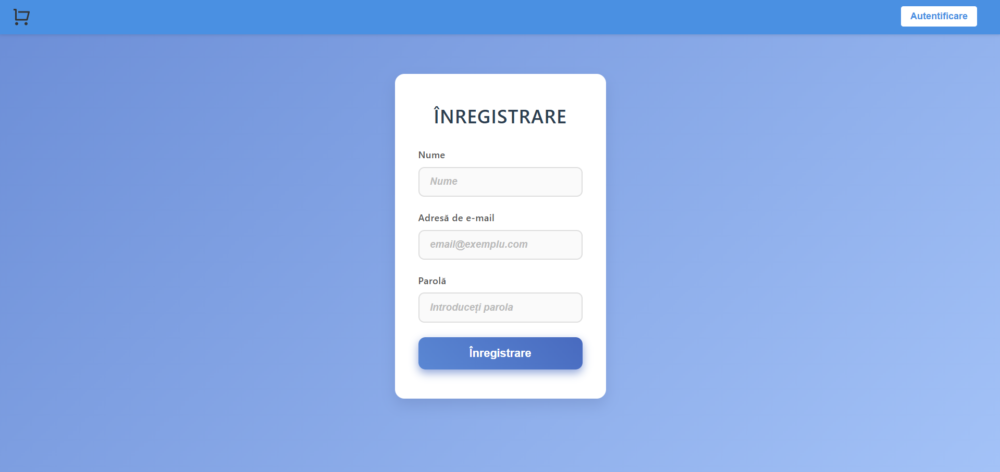
  

### Login form
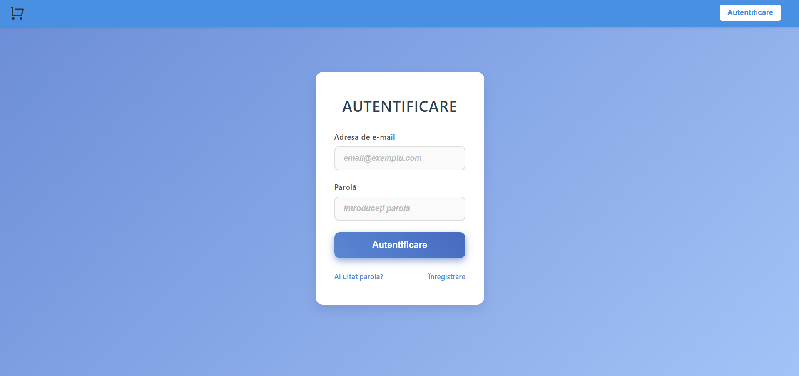
  

### Password reset link form
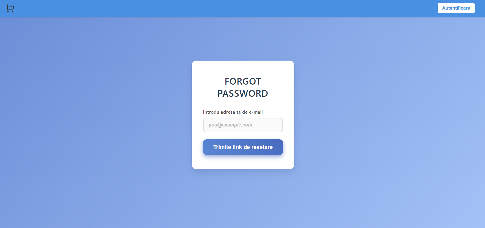
  

### Password reset form
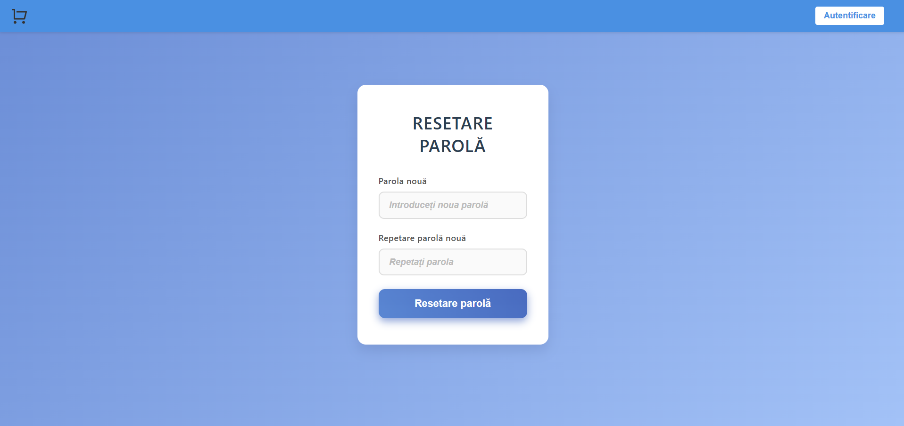
  

### Ad publishing form
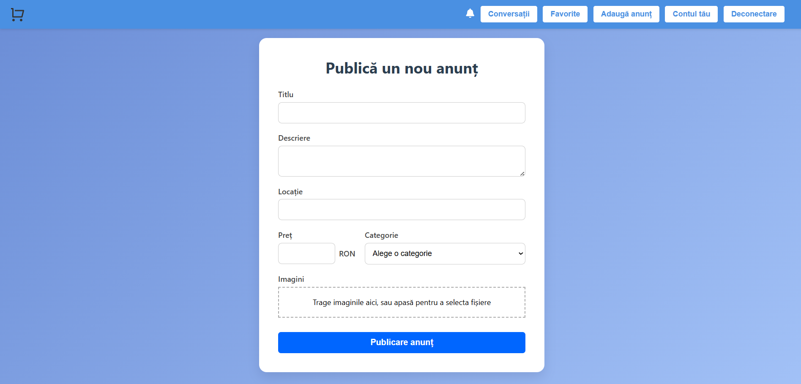
  

### Favorite ads page
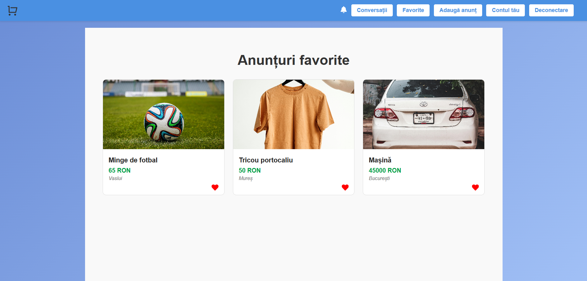
  

### User profile page
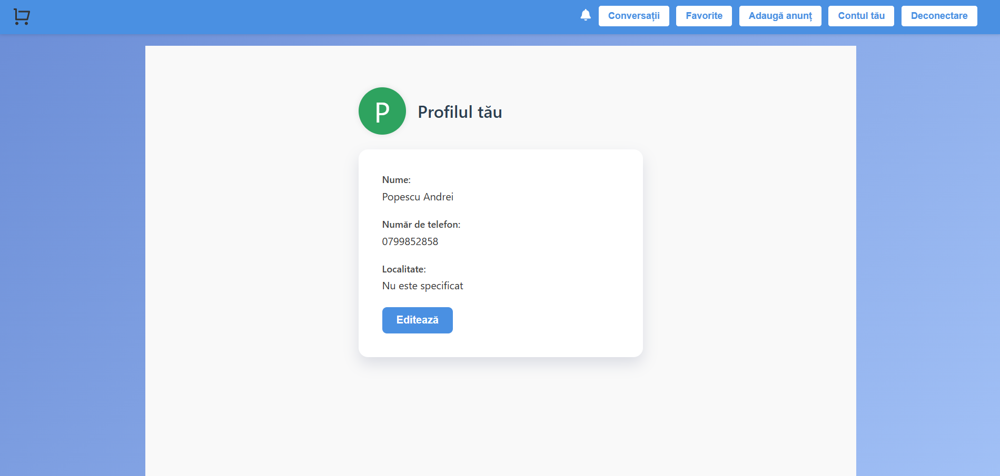
  

### View own ads
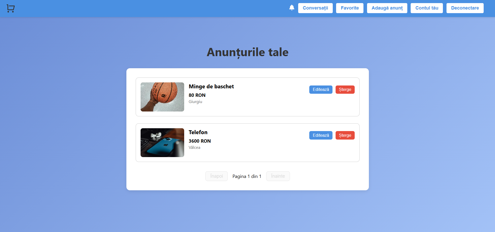
  

### Ad editing form
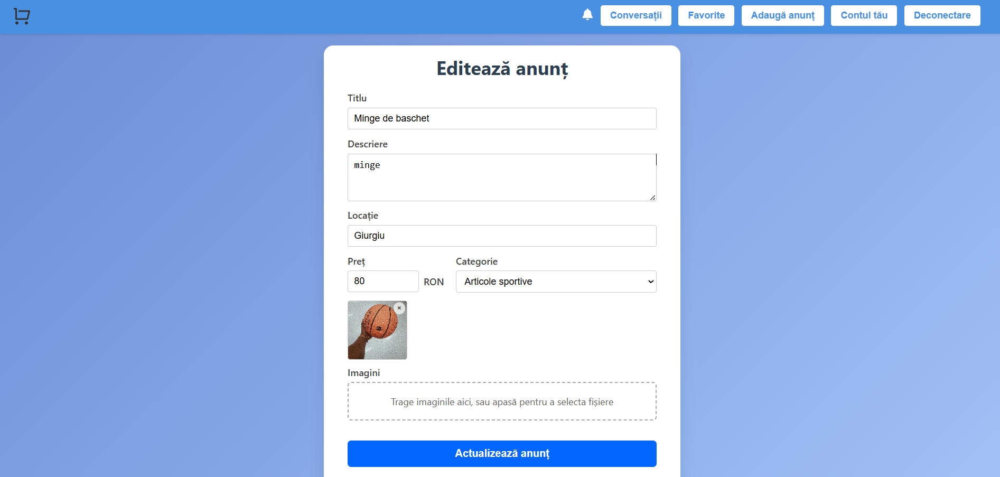
  

### Chat page
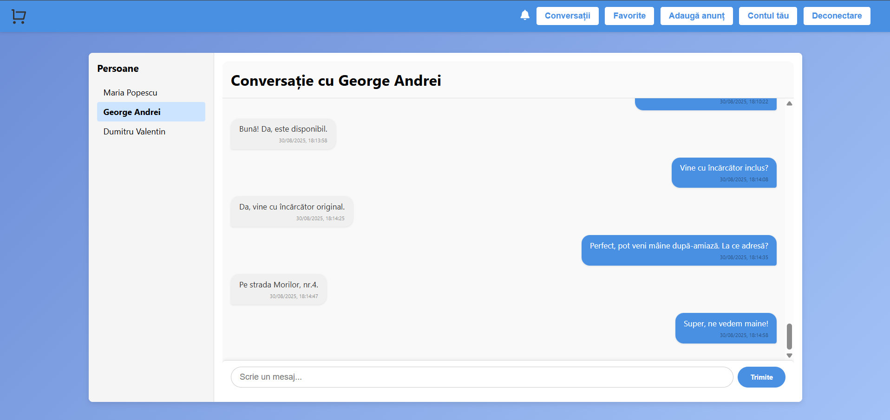
  

### Notification window
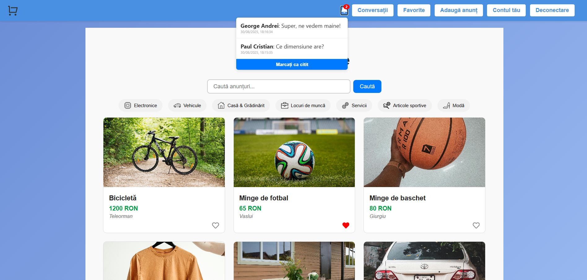

